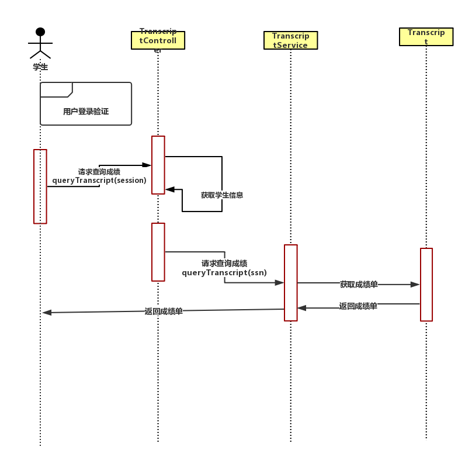
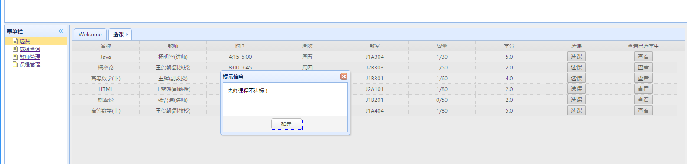
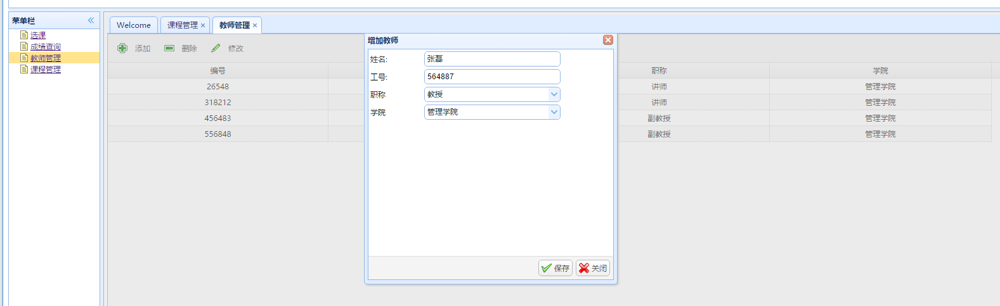

l## SRS
选课系统

## 项目结构

## ER图

## 系统领域类图

## 流程图

## 登录

## 选课界面

## 选课提示(可提示是否已选，是否在培养计划内，先修课程是否达标)

## 查看已选同学

## 成绩查询

## 添加、更新、删除教师

## 课程管理

## 添加、删除课程

## 测试（查询课程、添加课程、删除课程）

## 测试（添加、删除、修改教师）

